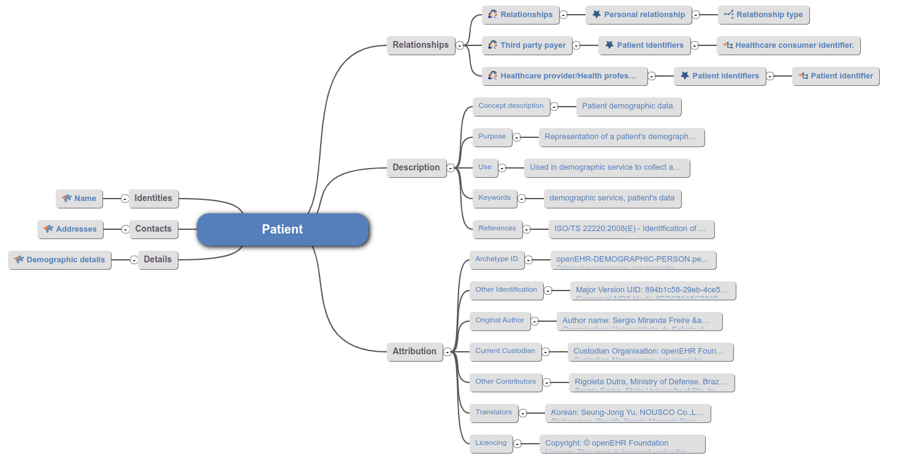
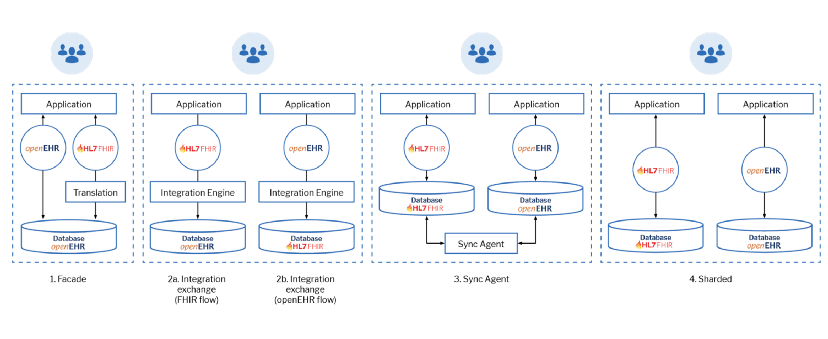

# Equipe Datassauros

| Nome                       | RA     |
| -------------------------- | ------ |
| Artur Abreu                | 231713 |
| Cristiano Sampaio Pinheiro | 256352 |
| George Gigilas Junior      | 216741 |
| Jhonatan Cléto             | 256444 |
| Mylena Roberta dos Santos  | 222687 |

# Proposta de SGBD

## Modelagem dos Banco de Dados

Modelo de um paciente gerado pelo [Synthea](https://github.com/synthetichealth/synthea/wiki).

### Patients
| | Column Name | Data Type | Required? | Description |
|-|-------------|-----------|-----------|-------------|
| :key: | Id | UUID | `true` | Primary Key. Unique Identifier of the patient. |
| | BirthDate | Date (`YYYY-MM-DD`) | `true` | The date the patient was born. |
| | DeathDate | Date (`YYYY-MM-DD`) | `false` | The date the patient died. |
| | ~~SSN~~ | String | `true` | Patient Social Security identifier. |
| | ~~Drivers~~ | String | `false` | Patient Drivers License identifier. |
| | ~~Passport~~ | String | `false` | Patient Passport identifier. |
| | ~~Prefix~~ | String | `false` | Name prefix, such as `Mr.`, `Mrs.`, `Dr.`, etc. |
| | First | String | `true` | First name of the patient. |
| | Last | String | `true` | Last or surname of the patient. |
| | ~~Suffix~~ | String | `false` | Name suffix, such as `PhD`, `MD`, `JD`, etc. |
| | Maiden | String | `false` | Maiden name of the patient. |
| | Marital | String | `false` | Marital Status. `M` is married, `S` is single. Currently no support for divorce (`D`) or widowing (`W`) |
| | Race | String | `true` | Description of the patient's primary race. |
| | Ethnicity | String | `true` | Description of the patient's primary ethnicity. |
| | Gender | String | `true` | Gender. `M` is male, `F` is female. |
| | BirthPlace | String | `true` | Name of the town where the patient was born. |
| | Address | String | `true` | Patient's street address without commas or newlines. |
| | City | String | `true` | Patient's address city. |
| | State | String | `true` | Patient's address state. |
| | County | String | `false` | Patient's address county. |
| | Zip | String | `false` | Patient's zip code. |
| | ~~Lat~~ | Numeric | `false` | Latitude of Patient's address. |
| | ~~Lon~~ | Numeric | `false` | Longitude of Patient's address. |
| | ~~Healthcare_Expenses~~ | Numeric | `true` | The total lifetime cost of healthcare to the patient (i.e. what the patient paid). |
| | ~~Healthcare_Coverage~~ | Numeric | `true` | The total lifetime cost of healthcare services that were covered by Payers (i.e. what the insurance company paid). |
| | ~~Income~~ | Numeric | `true` | Annual income for the Patient |

Synthea apresenta resultados de exames como observações, não aparenta ser otimizado para esse projeto.

### Observations
| | Column Name | Data Type | Required? | Description |
|-|-------------|-----------|-----------|-------------|
| | Date | iso8601 UTC Date (`yyyy-MM-dd'T'HH:mm'Z'`) | `true` | The date and time the observation was performed. |
| :old_key: | Patient | UUID | `true` | Foreign key to the Patient. |
| :old_key: | ~~Encounter~~ | UUID | `true` | Foreign key to the Encounter where the observation was performed. |
| | Category | String | `false` | Observation category. |
| | Code | String | `true` | Observation or Lab code from LOINC |
| | Description | String | `true` | Description of the observation or lab. |
| | Value | String | `true` | The recorded value of the observation. |
| | Units | String | `false` | The units of measure for the value. |
| | Type | String | `true` | The datatype of `Value`: `text` or `numeric` |

### Principais dados em um hemograma

<table> <thead><tr tablehead1=""><th style="text-align:left" scope="col">

 
Test

</th><th style="text-align:left" scope="col">

 
What It Measures

</th><th style="text-align:left" scope="col">

 
Normal Values

</th></tr></thead> <tbody><tr class="odd"><td>
 
Hemoglobin 

</td><td>
 
Amount of this oxygen-carrying protein within a volume of blood 

</td><td>
 
Men: 14 to 17 grams per deciliter (140 to 170 grams/L)

 
Women: 12 to 16 grams per deciliter (120 to 160 grams/L)

</td></tr><tr class="even"><td>
 
Hematocrit 

</td><td>
 
Proportion of the total amount of blood (blood volume) made up of red blood cells (plasma makes up the rest) 

</td><td>
 
Men: 41 to 51%

 
Women: 36 to 47%

</td></tr><tr class="odd"><td>
 
Mean cellular (or corpuscular) volume (MCV) 

</td><td>
 
Average volume of a red blood cell 

</td><td>
 
80 to 100 femtoliters per cell

</td></tr><tr class="even"><td>
 
Mean cellular (or corpuscular) hemoglobin (MCH)

</td><td>
 
Amount of hemoglobin per red blood cell

</td><td>
 
28 to 32 picograms per cell

</td></tr><tr class="odd"><td>
 
Mean cellular (or corpuscular) hemoglobin concentration (MCHC) 

</td><td>
 
Average concentration of hemoglobin within red blood cells 

</td><td>
 
32 to 36 grams per deciliter of red blood cells (320 to 360 grams per liter) 

</td></tr><tr class="even"><td>
 
Red blood cell (RBC) count

</td><td>
 
Number of red blood cells in a volume of blood

</td><td>
 
Men: 4.5 to 5.9 million cells per microliter (4.5 to 5.9 × 1012/L)

 
Women: 4.0 to 5.2 million cells per microliter (4.05 to 5.2 × 1012/L)

</td></tr><tr class="odd"><td>
 
Red cell distribution width

</td><td>
 
Amount of variability in the sizes of the red blood cells

</td><td>
 
11.5 to 14.5%

</td></tr><tr class="even"><td>
 
White blood cell count 

</td><td>
 
Number of white blood cells in a specified volume of blood 

</td><td>
 
 4,500 to 11,000 per microliter (4.5 to 11 × 109/L) 

</td></tr><tr class="odd"><td>
 
Differential white blood cell count 

</td><td>
 
Percentages and numbers of the different types of white blood cells 

</td><td>
 
Segmented neutrophils: 40 to 70%, or 1800 to 7700 per microliter (1.8 to 7.7 x 109/L)

 
Lymphocytes: 22 to 44%, or 1000 to 4800 per microliter (1 to 4.8 × 109/L)

 
Monocytes: 4 to 11%, or 200 to 1200 per microliter (0.2 to 1.2 × 109/L)

 
Eosinophils: 0 to 8%, or 0 to 900 per microliter (0 to 0.9 × 109/L)

 
Basophils: 0 to 3%, or 0 to 300 per microliter (0 to 0.3 × 109/L)

</td></tr><tr class="even"><td>
 
Platelet count 

</td><td>
 
Number of platelets in a specified volume of blood 

</td><td>
 
140,000 to 450,000 per microliter (140 to 450 × 109/L)

</td></tr></tbody> <tfoot><tr><td colspan="3">
 
* Normal values vary from laboratory to laboratory.

</td></tr></tfoot> </table>

[Complete Blood Count - MSD Manual](https://www.msdmanuals.com/en-kr/home/multimedia/table/complete-blood-count-cbc)

Pode-se implementar uma base contendo todos os dados do exame acrescidos de uma chave estrangeira para o paciente e um campo contendo a data do exame.
As bases usadas devem esta de acordo com o os padões do OpenEHR e possibilitar a geração de dados através de algum software.

## OpenEHR: Modelo e Armazenamento de Dados

É necessário reunir especialistas na área de saúde para modelar e configurar a implementação do openEHR de acordo com as necessidades do sistema. Em todo caso, o modelo vai ser construído em cima do modelo de referência do openEHR, que permite uma grande robustez do sistema, principalmente para o armazenamento dos dados. Além de todo esse ferramental, o openEHR também possui uma query language (similar a um SQL), que otimiza a busca por informações nesse banco de dados.

Uma vez construído, o modelo será bastante poderoso. Será então necessário facilitar sua comunicação com os outros componentes do sistema, o que poderá ser feito através do FHIR. Mais detalhes sobre isso se encontram na próxima seção.

[Patient Archetype OpenEHR](https://ckm.openehr.org/ckm/archetypes/1013.1.821/mindmap)

[EHRbase](https://ehrbase.org/)

https://stackoverflow.com/questions/25449018/how-is-openehr-supposed-to-be-used

## Comunicação entre OpenEHR DB e HL7 FHIR

Um dos maiores desafios da integração e que ainda não há soluções prontas para fazer a transcrição entre OpenEHR e FHIR. O software deve ser desenvolvido sobre medida ou desenvolver um mecanismo de integração proprietário.

Diversos autores e usuários dessas tecnologias afirmam que é muito vantajoso integrar os dois. Enquanto o openEHR é um sistema poderoso para armazenar os dados de forma consistente e permanente, o FHIR é ótimo para transferência de dados e uso em APIs. Seguem algumas formas encontradas para uso integrado dos dois:

Pelo que foi pesquisado, são 4 as formas mais utilizadas:
+ Facade: utilizar um banco de dados segundo o padrão openEHR e realizar operações sobre ele com o FHIR e com próprio openEHR. O artifício que permite o uso do FHIR é um componente de tradução entre os dois padrões. Essa forma é interessante pois concentra tudo em um único banco de dados, combinando as vantagens de cada padrão.
+ Message Broker: uma ideia que funciona melhor na teoria do que na prática consiste em utilizar message brokers (ou tradutores de padrões) para possibilitar que os padrões se comuniquem. Porém, não parece muito vantajoso ter 2 bancos de dados e com modelos adotados diferentes.
+ Sync Agent: consiste em ter dois bancos de dados, um para cada modelo, e utilizar um "agente sincronizador" para manter os dois atualizados. Novamente, não parece interessante guardar a mesma informação em dois bancos de dados diferentes.
+ Sharded: essa implementação pode ser interessante, pois consiste em ter um banco de dados para cada padrão, de acordo com o padrão mais adequado para cada tipo de dado. Por exemplo, pode-se utilizar o openEHR para guardar dados de exames dos pacientes e o FHIR para guardar dados administrativos

[FHIR + openEHR — 2022](https://medium.com/@alastairallen/fhir-openehr-2022-53716f837340)

[Mapping of OpenEHR Archetypes to
FHIR Resources in Use Case Oncology](https://ebooks.iospress.nl/pdf/doi/10.3233/SHTI210616)
